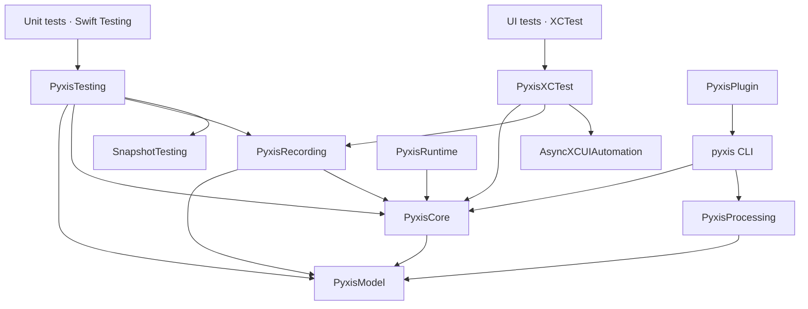

# Swift Testing recording

Link `PyxisTesting` into an iOS unit-test target. It directly depends on Point-Free's `SnapshotTesting`; no bridge target is needed. Use `Testing` for test discovery and assertions, and `SnapshotTesting` to choose an image strategy. View and view-controller strategies require a simulator or device; this does not make UIKit rendering a host-only test.

```swift
import Testing
import SnapshotTesting
import PyxisTesting

@MainActor
@Test
func emptyNotebook() async throws {
	try await withPyxisRecording(
		configuration: recordingConfiguration,
		recordingKey: "states.notebook.empty",
		journeyID: "notebook-fixtures",
		title: "Notebook fixtures",
		report: appliedFixtureReport
	) { recorder in
		try await recorder.capture(
			emptyNotebookState,
			value: makeNotebookController(notes: []),
			as: .image
		)
	}
}
```

The configuration, state, fixture report and controller factory above are consumer-owned. Build `PyxisSessionConfiguration` from project/run metadata, domains and a requested profile. `PyxisRecordingEnvironment` reads the CLI's shared run/device/profile values. Apply each requested condition yourself and report what you applied or observed; omitted values become unverified. Dependency mocks and application architecture stay outside Pyxis.

Every recording block requires a stable `recordingKey`. Include stable argument identity for independently replaceable parameterized cases. Each recording execution has a unique observation ID and its own sequence. UIKit operations run on the main actor, and overlapping operations on one recorder are rejected. Serialize suites that share windows or other global UI state, as Example does with `@Suite(.serialized)`. Await all recording work before returning from the block.

## Linking UI journeys and snapshot states



Arrows show module dependencies. SnapshotTesting and the test framework stay out of `PyxisRecording`. Both adapters write native attachments to xcresult; the CLI exports them, normalizes images, composes the recording store and writes the archive. The frontend reads the resulting format without a test-framework dependency.

Shared state IDs join captures at the same semantic state. They do not create transitions. Snapshot `transition(from:to:action:as:perform:)` records an action performed in that observation and renders the value returned by the action. Merely listing independently prepared fixtures should use separate captures.

Store replacement is scoped by recording key and requested conditions, independent of producer and test name. Distinct keys retain both contributions. The same key deliberately replaces that contribution, including when moving it from UI tests to unit tests. Conflicting state definitions referenced by retained recordings are rejected. `policy: update` explicitly replaces the whole context. Legacy observations without keys retain their existing journey/test scope.

## Capture and regression assertions

Captures normally only record an image. To also compare a baseline, pass `baseline: .init(directory: baselineDirectory, name: "empty")`. The rendered image is reused for comparison, avoiding a second view render; the supplied strategy's diffing rules are preserved. Baseline paths should be writable filesystem paths in your test process.

Use `record: true` explicitly when creating an approved baseline. Recording or mismatching a baseline fails the observation and enclosing test. It never silently produces a passed map contribution. SnapshotTesting controls baseline files; Pyxis stores the actual captured image as diagnostic evidence even if comparison fails.

Rendering has a five-second default timeout and observes task cancellation. Late or duplicate strategy callbacks cannot add captures after completion. Synchronous renderer work cannot be preempted; a result returned after its deadline is rejected. The strategy's own work cannot necessarily be cancelled; custom strategies should release their rendering resources themselves.

## Final native outcome

`#expect` records an issue without throwing. For that reason, the recording block emits incomplete fragments and a separate completion attachment. `pyxis export`, `capture` and `record` use xcresult's final native outcome before marking a Swift Testing observation passed. Failures before, inside or after the recording block remain failures.

Only completed recordings whose enclosing test and all reported executions passed are promoted. Skipped/unknown/missing completion remains incomplete. A failed parameter or retry conservatively rejects that native test's contributions rather than attributing an aggregate pass to individual attachments. Failed and incomplete exports remain inspectable but cannot advance a store.

Use Xcode's test runner to collect the iOS images and native attachment manifest. A standalone `swift test` run does not provide the xcresult transport expected by the CLI.

## Files and outputs

```text
YourTests/
  MapDeclarations.swift           shared states, domains, profiles
  Journeys.swift                  XCTest application interactions
  SnapshotStates.swift            Testing + prepared values and mocks
  __Snapshots__/                  optional SnapshotTesting baselines
recordings/<run-id>/
  plan.json                       resolved devices and conditions
  <device>/Tests.xcresult          images, fragment revisions, completion markers
  <device>/bundle/                exported/optimized device map
  bundle/manifest.json            this invocation's map
  bundle/assets/<sha256>.*        normalized assets
  coverage.json                   native outcomes and verified configurations
  recording.pyx                  this invocation only, nested test/variation archives
recording-store/
  assets/<sha256>.*               shared immutable image content
  snapshots/<snapshot-id>.json    immutable complete maps and run provenance
  heads/<context>.json            current snapshot per explicit context
  .runtime/                      writer lock and temporary staging
```

The exporter uses a disposable temporary directory while reading xcresult attachments; it does not mutate the retained result bundle. Store writes remain locked and publish the context head last. Consumer projects choose storage and baseline locations and source-control policy.

The [Example](../Example/README.md) includes both producers in `pyxis.yaml` and a selective snapshot-only configuration in `pyxis-snapshots.yaml`, sharing one store/context.
